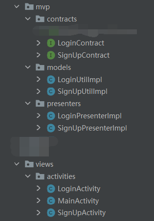
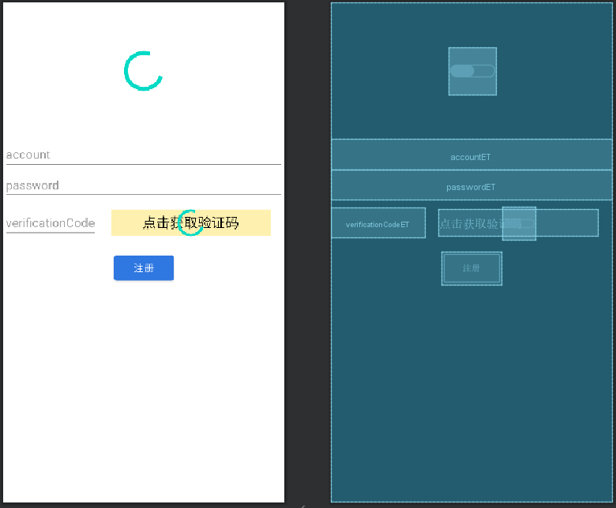
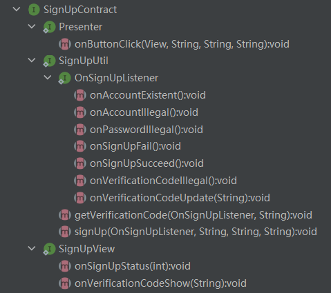
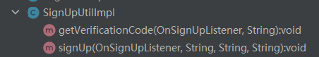
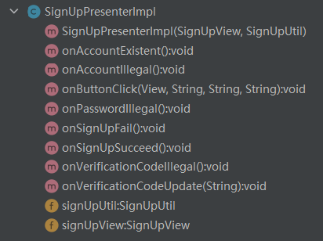
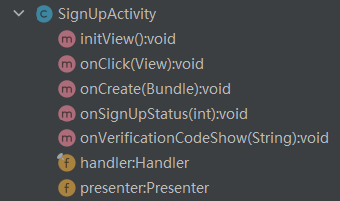

# 一、什么是MVP

M :  model 数据层，功能实现层；

V : view 视图层；

P : presenter 连接层，用于连接view与model。

mvp架构，主要是通过接口回调使得view与model之问不存在耦合，程序逻辑与视图更新分离

详见参考文章：[Android MVP架构_Amosstan的博客-CSDN博客](https://blog.csdn.net/Amosstan/article/details/115159719)

# 二、代码结构

这个一个实现登陆注册功能的Demo



可以看到主要分为4个包：

contracts : 编写model,view,presenters要用的回调接口；

models : 编写逻辑代码，如发送网络请求、进行数据传输、数据的增删改查等；

presenters : 实现接口回调，连接view与model

views : 更新视图

## 注册模块为例

以注册模块为例，可以举一反三

## 在注册模块用到的常量

```java
public class StatusType {
    public static final int SIGN_UP_SUCCEED = 0;//注册成功
    public static final int SIGN_UP_ACCOUNT_ILLEGAL = 1;//输入的账号格式错误
    public static final int SIGN_UP_PASSWORD_ILLEGAL = 2;//输入的密码格式错误
    public static final int SIGN_UP_VERIFICATION_CODE_ILLEGAL = 3;//输入的验证码错误
    public static final int SIGN_UP_FAIL = 4;//注册失败
    public static final int SIGN_UP_VERIFICATION_CODE_UP_DATE = 5;//验证码更新
    public static final int SIGN_UP_ACCOUNT_EXISTENT = 6;//账号已存在
}
```

## activity_sign_up.xml

布局预览：



xml代码如下：

```xml
<?xml version="1.0" encoding="utf-8"?>
<androidx.constraintlayout.widget.ConstraintLayout xmlns:android="http://schemas.android.com/apk/res/android"
    xmlns:app="http://schemas.android.com/apk/res-auto"
    xmlns:tools="http://schemas.android.com/tools"
    android:layout_width="match_parent"
    android:layout_height="match_parent"
    tools:context=".views.activities.SignUpActivity">

    <EditText
        android:id="@+id/accountET"
        android:layout_width="match_parent"
        android:layout_height="wrap_content"
        android:layout_marginTop="200dp"
        android:hint="account"
        app:layout_constraintTop_toTopOf="parent" />

    <EditText
        android:inputType="textPassword"
        android:id="@+id/passwordET"
        android:layout_width="match_parent"
        android:layout_height="wrap_content"
        android:hint="password"
        app:layout_constraintTop_toBottomOf="@+id/accountET" />

    <EditText
        android:inputType="numberPassword"
        android:id="@+id/verificationCodeET"
        android:layout_width="0dp"
        android:layout_height="wrap_content"
        android:layout_marginTop="10dp"
        android:hint="verificationCode"
        app:layout_constraintStart_toStartOf="parent"
        app:layout_constraintTop_toBottomOf="@+id/passwordET" />

    <TextView
        android:layout_marginVertical="3dp"
        android:layout_marginHorizontal="20dp"
        android:id="@+id/verificationCodeTV"
        android:layout_width="0dp"
        android:layout_height="0dp"
        android:background="#65FDD835"
        android:gravity="center"
        android:text="点击获取验证码"
        android:textColor="@color/black"
        android:textSize="20sp"
        app:layout_constraintBottom_toBottomOf="@+id/verificationCodeET"
        app:layout_constraintEnd_toEndOf="parent"
        app:layout_constraintStart_toEndOf="@+id/verificationCodeET"
        app:layout_constraintTop_toTopOf="@+id/verificationCodeET" />

    <Button
        android:id="@+id/signUpBt"
        android:layout_width="wrap_content"
        android:layout_height="wrap_content"
        android:layout_marginTop="20dp"
        android:backgroundTint="#2F77E1"
        android:text="注册"
        app:layout_constraintEnd_toEndOf="parent"
        app:layout_constraintStart_toStartOf="parent"
        app:layout_constraintTop_toBottomOf="@+id/verificationCodeET" />

    <ProgressBar
        android:id="@+id/getCodeProgressBar"
        style="?android:attr/progressBarStyle"
        android:layout_width="wrap_content"
        android:layout_height="wrap_content"
        app:layout_constraintBottom_toBottomOf="@+id/verificationCodeTV"
        app:layout_constraintEnd_toEndOf="parent"
        app:layout_constraintStart_toEndOf="@+id/verificationCodeET"
        app:layout_constraintTop_toTopOf="@+id/verificationCodeTV" />

    <ProgressBar
        android:id="@+id/signUpProgressBar"
        style="?android:attr/progressBarStyle"
        android:layout_width="70dp"
        android:layout_height="70dp"
        app:layout_constraintBottom_toTopOf="@+id/accountET"
        app:layout_constraintEnd_toEndOf="parent"
        app:layout_constraintStart_toStartOf="parent"
        app:layout_constraintTop_toTopOf="parent" />

</androidx.constraintlayout.widget.ConstraintLayout>
```


## SignUpContract：

结构预览：



代码如下：

```java
public interface SignUpContract {
    /**
     * 用于SignUpActivity中
     */
    interface SignUpView{
        void onSignUpStatus(int status);//注册状态，成功，失败等
        void onVerificationCodeShow(String verificationCode);//显示从后端返回的验证码数字
    }

    /**
     * 用于LSignUpUtilImpl
     */
    interface SignUpUtil{
        /**
        * 注册状态监听
        */
        interface OnSignUpListener {
            void onAccountExistent();//账号已存在
            void onSignUpSucceed();//注册成功
            void onSignUpFail();//注册失败
            void onVerificationCodeUpdate(String verificationCode);//更新验证码图片
            void onAccountIllegal();//输入的账号格式错误
            void onPasswordIllegal();//输入的密码格式错误
            void onVerificationCodeIllegal();//输入的验证码错误
        }
        void signUp(OnSignUpListener signUpListener, String account, String password, String verificationCode);//注册账号
        void getVerificationCode(OnSignUpListener signUpListener, String account);//获取验证码
    }

    /**
     * 用于PresenterImpl中
     */
    interface Presenter {
        void onButtonClick(View view,String account, String password, String verificationCode); //按键点击事件
    }
}
```

## SignUpUtilImpl

结构预览：



代码如下：

```java
public class SignUpUtilImpl implements SignUpContract.SignUpUtil {

    /**
     * 检查输入是否合法
     * 合法则发送网络请求
     */
    @Override
    public void signUp(OnSignUpListener signUpListener, String account, String password, String verificationCode) {

        if(!(password.length()>=8&&password.length()<=16))
            signUpListener.onPasswordIllegal();//输入的密码格式错误
        else{
            new Thread(new Runnable() {
                @Override
                public void run() {
                    OkHttpClient client=new OkHttpClient();
                    //构建表单参数
                    FormBody.Builder requestBuild=new FormBody.Builder();
                    //添加Post请求体
                    RequestBody requestBody=requestBuild
                            .add("account",account)
                            .add("password",password)
                            .add("code",verificationCode)
                            .build();
                    Request request=new Request.Builder().url(Config.SIGN_URL).post(requestBody).build();
                    client.newCall(request).enqueue(new Callback() {
                        //网络请求失败
                        @Override
                        public void onFailure(@NonNull Call call, @NonNull IOException e) {
                            signUpListener.onSignUpFail();//注册失败
                        }
                        //网络请求成功
                        @Override
                        public void onResponse(@NonNull Call call, @NonNull Response response) throws IOException {
                            String  result = Objects.requireNonNull(response.body()).string();//从服务器返回的结果
                            if(result.equals("succeed")){
                                signUpListener.onSignUpSucceed();//注册成功
                            }else if(result.equals("code_error")) {
                                signUpListener.onVerificationCodeIllegal();//验证码错误
                            }else if(result.equals("account_existent")){
                                signUpListener.onAccountExistent();//账号已存在
                            }else {
                                signUpListener.onSignUpFail();//返回数据有问题，如404，注册失败
                            }
                            Log.d("TAG",result);
                            if (response.body()!=null){
                                Objects.requireNonNull(response.body()).close();
                            }
                        }
                    });

                }
            }).start();
        }
    }

    @Override
    public void getVerificationCode(OnSignUpListener signUpListener, String account) {
        new Thread(new Runnable() {
            @Override
            public void run() {
                OkHttpClient client=new OkHttpClient();
                //构建表单参数
                FormBody.Builder requestBuild=new FormBody.Builder();
                //添加请求体
                RequestBody requestBody=requestBuild
                        .add("account",account)
                        .build();
                Request request=new Request.Builder().url(Config.GET_VERIFICATION_CODE_URL).post(requestBody).build();
                client.newCall(request).enqueue(new Callback() {
                    //失败
                    @Override
                    public void onFailure(@NonNull Call call, @NonNull IOException e) {
                        signUpListener.onVerificationCodeUpdate("获取失败");
                    }
                    //成功
                    @Override
                    public void onResponse(@NonNull Call call, @NonNull Response response) throws IOException {
                        String  result = Objects.requireNonNull(response.body()).string();
                        signUpListener.onVerificationCodeUpdate(result);//成功拿到验证码
                        if (response.body()!=null){
                            Objects.requireNonNull(response.body()).close();
                        }
                    }
                });

            }
        }).start();
    }
}
```

## SignUpPresenterImpl:

结构预览：



代码如下：

```java
public class SignUpPresenterImpl implements SignUpContract.Presenter, SignUpContract.SignUpUtil.OnSignUpListener {

    private SignUpContract.SignUpView signUpView=null;
    private SignUpContract.SignUpUtil signUpUtil=null;

    public SignUpPresenterImpl(SignUpContract.SignUpView signUpView, SignUpContract.SignUpUtil signUpUtil) {
        this.signUpView = signUpView;
        this.signUpUtil = signUpUtil;
    }

    @Override
    public void onAccountExistent() {
        signUpView.onSignUpStatus(StatusType.SIGN_UP_ACCOUNT_EXISTENT);
    }

    @Override
    public void onSignUpSucceed() {
        signUpView.onSignUpStatus(StatusType.SIGN_UP_SUCCEED);
    }

    @Override
    public void onSignUpFail() {
        signUpView.onSignUpStatus(StatusType.SIGN_UP_FAIL);
    }

    @Override
    public void onVerificationCodeUpdate(String verificationCode) {
        signUpView.onVerificationCodeShow(verificationCode);
    }

    @Override
    public void onAccountIllegal() {
        signUpView.onSignUpStatus(StatusType.SIGN_UP_ACCOUNT_ILLEGAL);
    }

    @Override
    public void onPasswordIllegal() {
        signUpView.onSignUpStatus(StatusType.SIGN_UP_PASSWORD_ILLEGAL);
    }

    @Override
    public void onVerificationCodeIllegal() {
        signUpView.onSignUpStatus(StatusType.SIGN_UP_VERIFICATION_CODE_ILLEGAL);
    }

    @SuppressLint("NonConstantResourceId")
    @Override
    public void onButtonClick(View view, String account, String password, String verificationCode) {
        switch (view.getId()){
            case R.id.verificationCodeTV:
                signUpUtil.getVerificationCode(this,account);
                break;
            case R.id.signUpBt:
                signUpUtil.signUp(this,account,password,verificationCode);
                break;
        }
    }
}
```

## SignUpActivity：

结构预览：



代码如下：

```java
public class SignUpActivity extends BaseActivity<ActivitySignUpBinding> implements SignUpContract.SignUpView, View.OnClickListener {

    private SignUpContract.Presenter presenter = null;
    private final Handler handler = new Handler(Looper.myLooper()) {
        @Override
        public void handleMessage(@NonNull Message msg) {
            super.handleMessage(msg);
            switch (msg.what) {
                case StatusType.SIGN_UP_SUCCEED:
                    Toast.makeText(SignUpActivity.this, "注册成功", Toast.LENGTH_SHORT).show();
                    getBinding().signUpBt.setEnabled(true);
                    getBinding().signUpProgressBar.setVisibility(View.GONE);
                    finish();//注册成功关闭注册页面
                    break;
                case StatusType.SIGN_UP_ACCOUNT_ILLEGAL:
                    Toast.makeText(SignUpActivity.this, "手机号格式错误", Toast.LENGTH_SHORT).show();
                    getBinding().signUpBt.setEnabled(true);
                    getBinding().signUpProgressBar.setVisibility(View.GONE);
                    getBinding().verificationCodeTV.setText("点击获取验证码");
                    break;
                case StatusType.SIGN_UP_PASSWORD_ILLEGAL:
                    Toast.makeText(SignUpActivity.this, "密码格式不符合条件", Toast.LENGTH_SHORT).show();
                    getBinding().signUpBt.setEnabled(true);
                    getBinding().signUpProgressBar.setVisibility(View.GONE);
                    getBinding().verificationCodeTV.setText("点击获取验证码");
                    break;
                case StatusType.SIGN_UP_VERIFICATION_CODE_ILLEGAL:
                    Toast.makeText(SignUpActivity.this, "验证码错误", Toast.LENGTH_SHORT).show();
                    getBinding().signUpBt.setEnabled(true);
                    getBinding().signUpProgressBar.setVisibility(View.GONE);
                    getBinding().verificationCodeTV.setText("点击获取验证码");
                    break;
                case StatusType.SIGN_UP_FAIL:
                    Toast.makeText(SignUpActivity.this, "注册失败，请重试", Toast.LENGTH_SHORT).show();
                    getBinding().signUpBt.setEnabled(true);
                    getBinding().signUpProgressBar.setVisibility(View.GONE);
                    getBinding().verificationCodeTV.setText("点击获取验证码");
                    break;
                case StatusType.SIGN_UP_VERIFICATION_CODE_UP_DATE:
                    getBinding().verificationCodeTV.setText(msg.obj.toString());
                    getBinding().verificationCodeTV.setEnabled(true);
                    getBinding().getCodeProgressBar.setVisibility(View.GONE);
                    break;
                case StatusType.SIGN_UP_ACCOUNT_EXISTENT:
                    Toast.makeText(SignUpActivity.this, "账号已存在", Toast.LENGTH_SHORT).show();
                    getBinding().signUpBt.setEnabled(true);
                    getBinding().signUpProgressBar.setVisibility(View.GONE);
                    getBinding().verificationCodeTV.setText("点击获取验证码");
            }
        }
    };

    @Override
    protected void onCreate(Bundle savedInstanceState) {
        super.onCreate(savedInstanceState);
        initView();
        presenter = new SignUpPresenterImpl(this, new SignUpUtilImpl());
    }

    /**
     * 为控件设置点击监听
     */
    private void initView() {
        getBinding().verificationCodeTV.setOnClickListener(this);
        getBinding().signUpBt.setOnClickListener(this);
        getBinding().signUpProgressBar.setVisibility(View.GONE);
        getBinding().getCodeProgressBar.setVisibility(View.GONE);
    }

    @Override
    public void onSignUpStatus(int status) {
        Message message = new Message();
        message.what = status;
        handler.sendMessage(message);
    }

    @Override
    public void onVerificationCodeShow(String verificationCode) {
        Message message = new Message();
        message.what = StatusType.SIGN_UP_VERIFICATION_CODE_UP_DATE;
        message.obj = verificationCode;
        handler.sendMessage(message);
    }

    @SuppressLint("NonConstantResourceId")
    @Override
    public void onClick(View v) {
        String account = getBinding().accountET.getText().toString();
        String password = getBinding().passwordET.getText().toString();
        String verificationCode = getBinding().verificationCodeET.getText().toString();
        presenter.onButtonClick(v, account, password, verificationCode);
        switch (v.getId()) {
            case R.id.verificationCodeTV:
                getBinding().verificationCodeTV.setEnabled(false);
                getBinding().verificationCodeTV.setText("");
                getBinding().getCodeProgressBar.setVisibility(View.VISIBLE);
                break;
            case R.id.signUpBt:
                getBinding().signUpBt.setEnabled(false);
                getBinding().signUpProgressBar.setVisibility(View.VISIBLE);
                break;
        }
    }
}
```

# 三、总结

- 由上面Demo代码可见，View只负责UI界面更新，Model只负责数据部分，Persenter作为View和Model的桥梁，在中间进行数据通讯
- MVP代码的本质就是CallBack的使用

# 四、参考文章

参考文章：[Android MVP架构_Amosstan的博客-CSDN博客](https://blog.csdn.net/Amosstan/article/details/115159719)

