# 一、创建项目

在IDEA 中用Spring Assistant创建SpringBoot项目

如果没有Spring Assistant选项，则去插件中下载

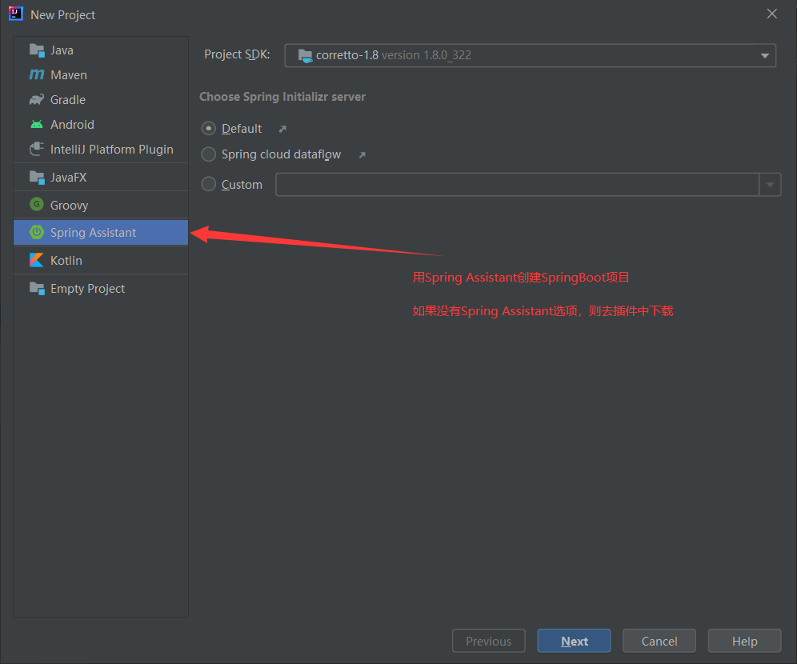

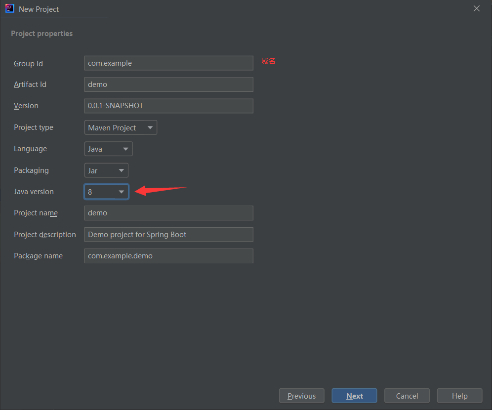

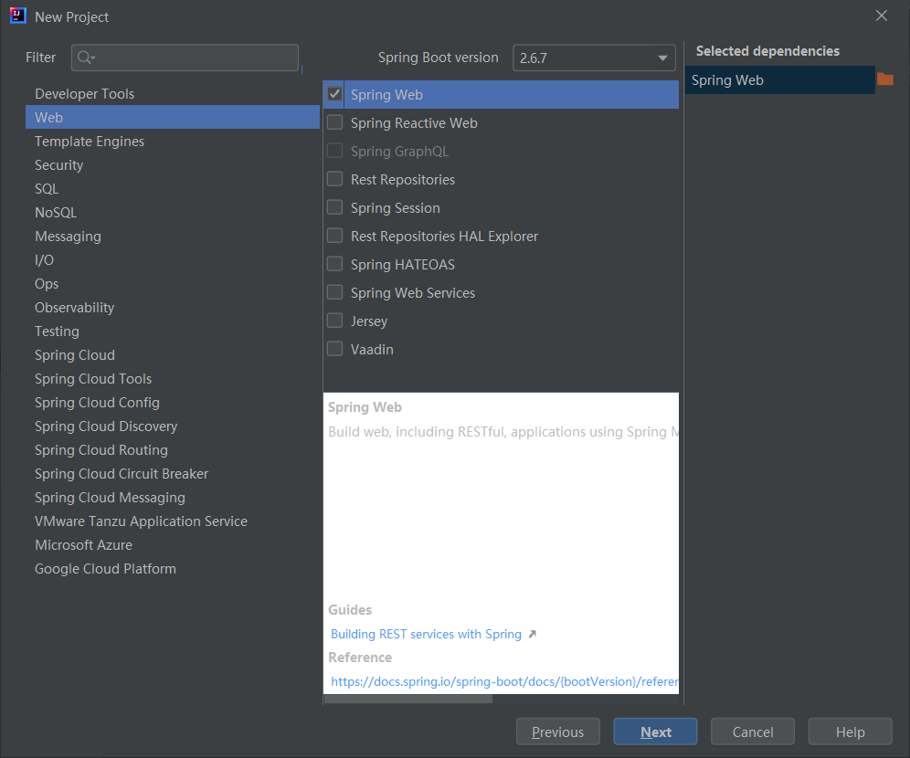

# 二、建包

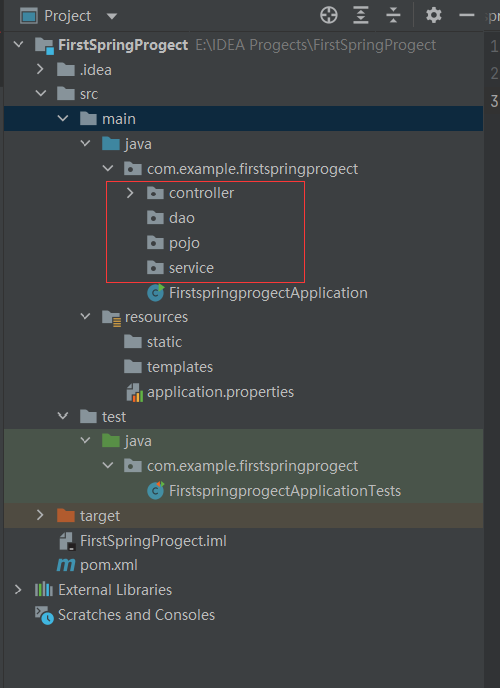

主入口，注意注解

```java
//这个Mian类本身就是SpringBoot的一个组件
//@SpringBootAppLlication :标注这个类是一个springboot的应用
@SpringBootApplication
public class FirstspringprogectApplication {

	public static void main(String[] args) {
		//将springboot的应用启动
		SpringApplication.run(FirstspringprogectApplication.class, args);
	}

}

```

在controler包中新建“接口”。一个可以供前端访问的接口,注意注解

```java
@RestController
@RequestMapping("/hello")
public class HelloController {
    //接口：http://localhost:8080/hello/hello
    @GetMapping("/hello")
    @ResponseBody
    public String hello(){
        //调用业务，接收前端参数
        return "helloworld";
    }
}
```

运行项目后tomcat服务会启动,tomcat服务是默认端口号是8080

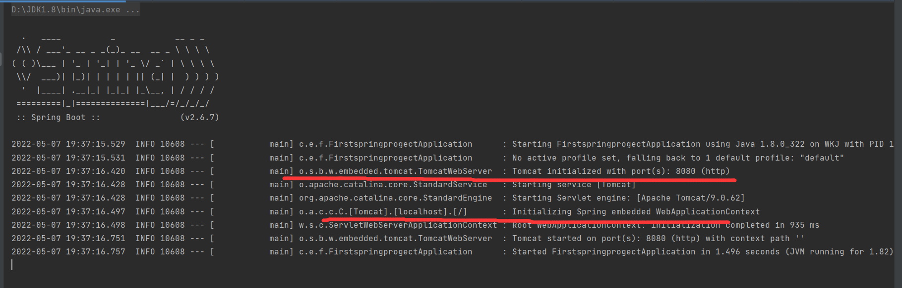

此时可以在**浏览器**访问刚刚写好的接口:http://localhost:8080/hello/hello

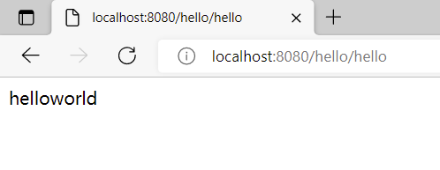

### 三、自定义设置

## 修改tomcat服务的端口号

当然，也可以修改tomcat服务的端口号，找到目录中的**application.properties**文件进行修改

```ini
#更改项目的端口号
server.port=8081
```

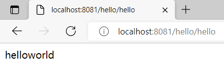

## 修改SpringBoot banner样式

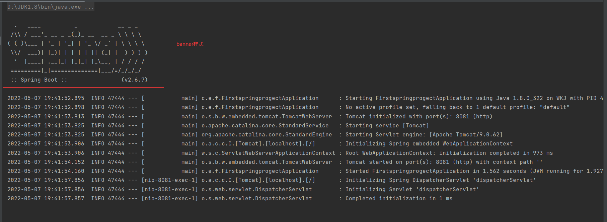

找一个字符艺术字体网站：https://www.bootschool.net/ascii-art/search

找一个你喜欢的复制下来

在目录的resources中新建一个banner.txt

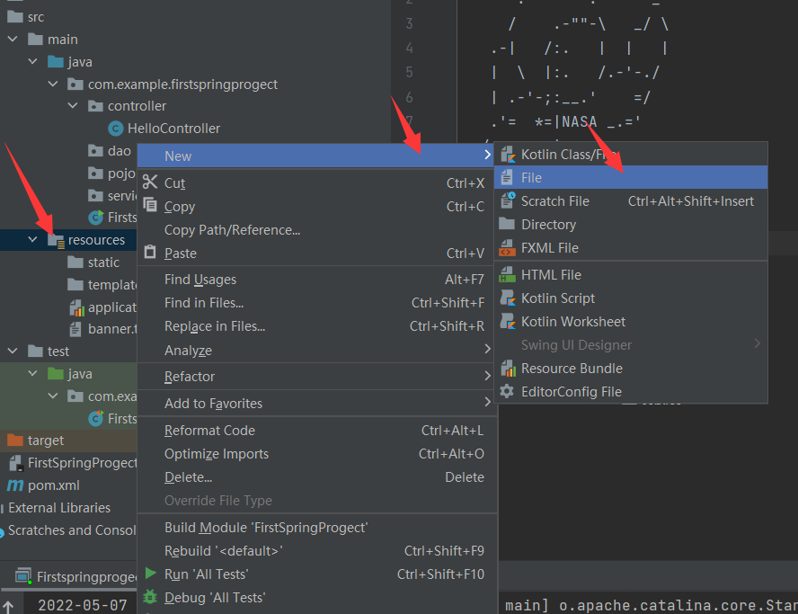

把字符粘贴进去

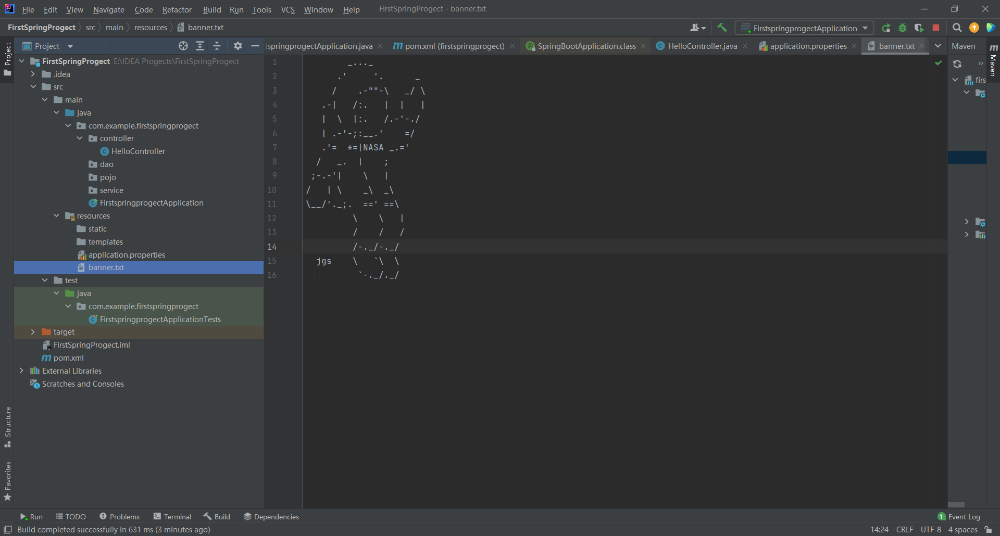

然后运行项目就好了！

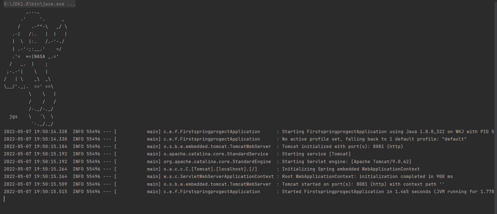

