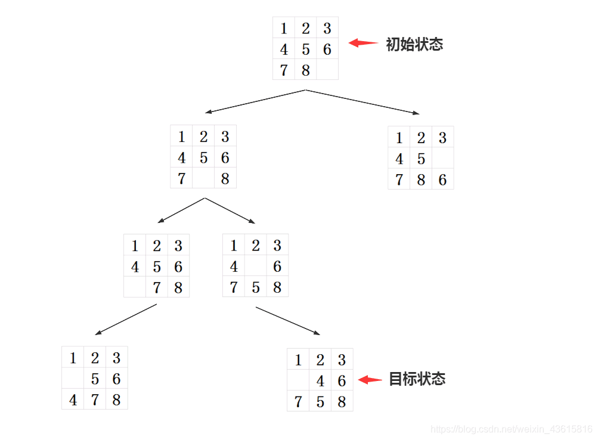

# 一、概括

> ​		广度优先搜索算法（又称宽度优先搜索）是最简便的图的搜索算法之一，这一算法也是很多重要的图的算法的原型。Dijkstra单源最短路径算法和Prim最小生成树算法都采用了和宽度优先搜索类似的思想。其别名又叫BFS（breadth-first search），属于一种盲目搜寻法，目的是系统地展开并检查图中的所有节点，以找寻结果。换句话说，它并不考虑结果的可能位置，彻底地搜索整张图，直到找到结果为止。

# 二、实现思路

> ​		从一个起点一直走，走不通就掉头，然后返回上一个节点换一条路继续走，**按照一定的规则和顺序**不停的去试来找到目标。
>
> 实现的方式有递归与非递归两种方式

# 三、例题

> 蓝桥杯1426 九宫重排


## 分析

> 以每一种状态作为节点进行搜索
>
> 将待搜索的节点按一定顺序放入一个队列中 ，待搜索入队，搜索后出队



## 非递归方式实现

```java
public class Main {
    /**
     * 将九宫格进行抽象，得如下坐标
     * 0 1 2
     * 3 4 5
     * 6 7 8
     */
    public static final int[] direction={-3,3,-1,1};//白格移动的方向(上下左右)
    public static boolean result=false;//是否找到相应路径
    public static void main(String[] arr) {
        Scanner scanner=new Scanner(System.in);
        String startState=scanner.nextLine();//读入初始状态
        String endState=scanner.nextLine();//读入终态
        Map<String,Integer> stateMap=new HashMap<>();//String:某一状态，Integer:从初态到此状态走了多少步
        ArrayList<String> arrayList=new ArrayList<>();//队列，按序存放着要处理的节点，待搜索入队，搜索后出队
        stateMap.put(startState,0);//初始化状态map
        arrayList.add(startState);//存入第一个要搜索的节点
        //BFS
        mark:while (!result&&!arrayList.isEmpty()){
            String temp=arrayList.remove(0);//搜索节点，出队，temp(即当前状态)为一会要搜索的节点
            int blankIndex=temp.indexOf('.');//白格当前坐标
            //白格分别向 上下左右 移动
            for(int i=0;i<4;i++){
                int index=blankIndex+direction[i];//移动后白格坐标
                if(index<0||index>8||Math.abs(blankIndex%3-index%3)==2) continue;//白格不要越界
                //交换前后坐标上的值(白格移动) newState为移动后的新状态
                String newState=temp.replace(temp.charAt(index),'*');
                newState=newState.replace('.',temp.charAt(index));
                newState=newState.replace('*','.');
                //判断新状态是否已在
                if(!stateMap.containsKey(newState)){
                    stateMap.put(newState, stateMap.get(temp)+1);//不存在则将它存入状态map
                    arrayList.add(newState);//不存在则加入队列
                    //判断此新状态是否为终态
                    if(newState.equals(endState)){
                        result=true;
                        break mark;
                    }
                }
            }
        }
        if(result)
            System.out.println(stateMap.get(endState));
        else
            System.out.println("不存在相应路径");
    }
}
```

## 递归方式实现